# Anivarya Setu

## About the Project:

#### There are two problem statements that we are trying to solve here:

1. Unorganised Ration Delivery: Currently we have an unorganised way of providing necessary food items like ration kit or        meals. Some area get meals thrice in a day whereas other not able to get it for a single time.
2. Overcrowded Shops: Currently people are not aware that which medical shop has least crowd + have  availability of masks/      sanitizers.

#### Solution:

1. Unorganised Ration Delivery:
   a. We are developing a web interface + android app to register all Organisations/ NGOs/ Volunteers who wants to help and         provide them the best location and path to provide their service.
   b. It helps Govt. authority to help in fulfilling need of someone as soon as possible by	nearest such bodies and prevent         overlapping of interested areas of such bodies.
   
2. Overcrowded Shops: 
   a. We used google map API to get nearest and least crowded shop. 
   b. Further there is a database to store infantry available at each shops, which will parse with the nearest shop queried         by user.

## Android App

#### For the android app we used the following tools and APIs:

1. Android Studio: The whole project is developed in Android Studio and is writtern in JAVA.
2. Google maps API: It is used to show the best location to provide serice for an Organisation/ NGO and to suggest nearest      and the least croweded shops to an individual.
3. Firebase: All the information provided by NGOs, Organisations, Shops, Customers are stored in the Firebase. We have used      Firebase Firestore for this purpose.

#### Demo-Link

#### Screenshots

<table>
  <tr>
    <td>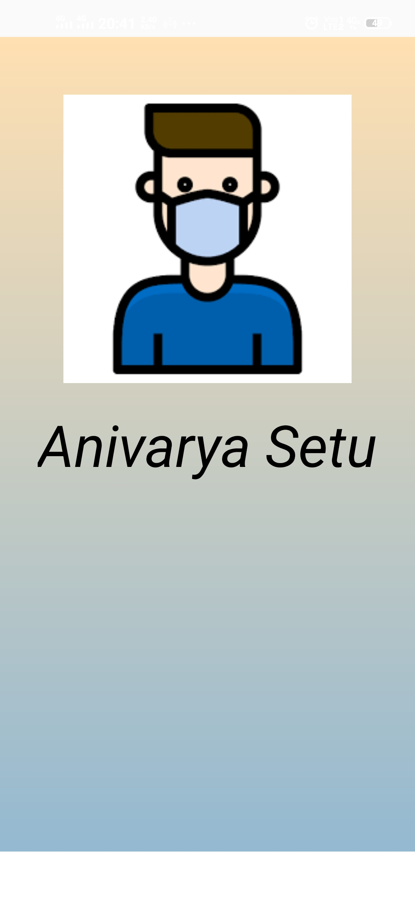</td>
    <td>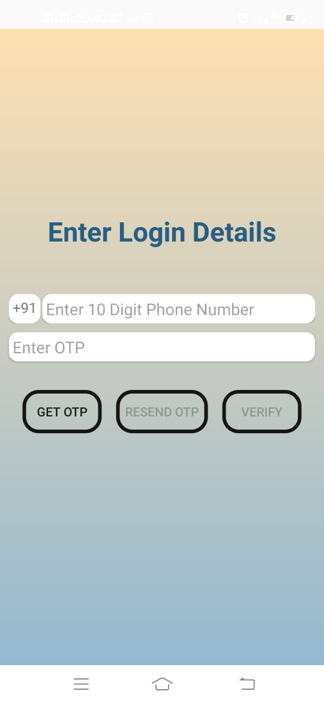</td>
    <td>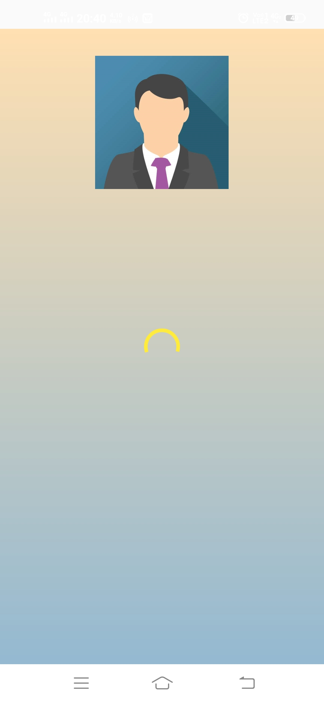</td>
  </tr>
  <tr>
    <td>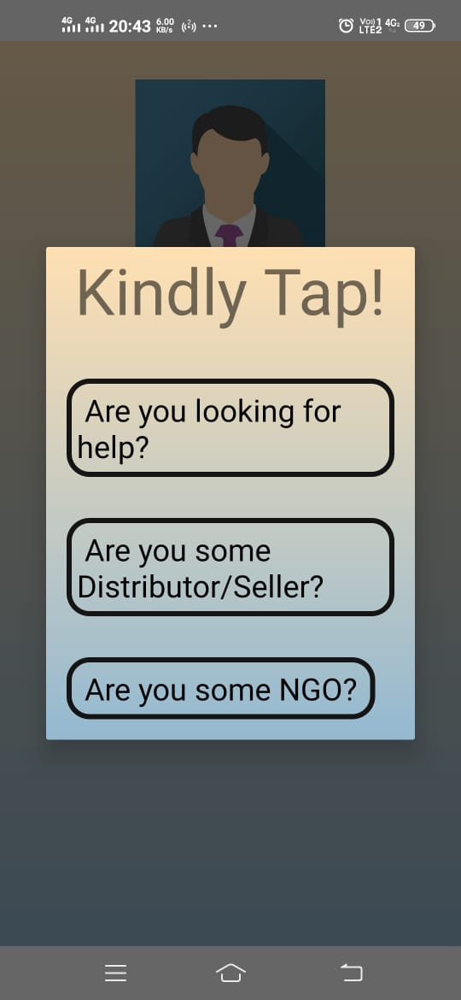</td>
    <td>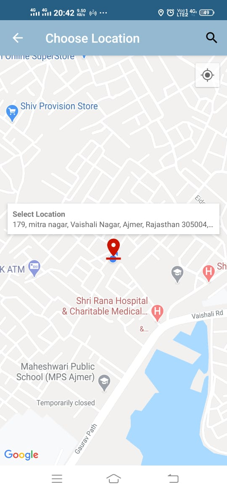</td>
    <td>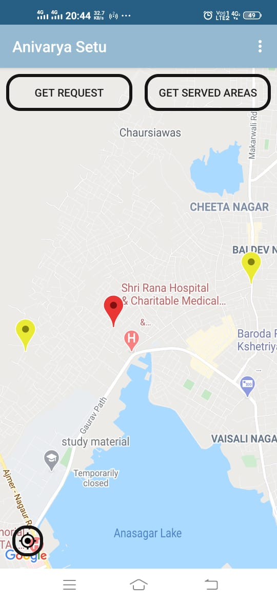</td>
  </tr>
  <tr>
    <td>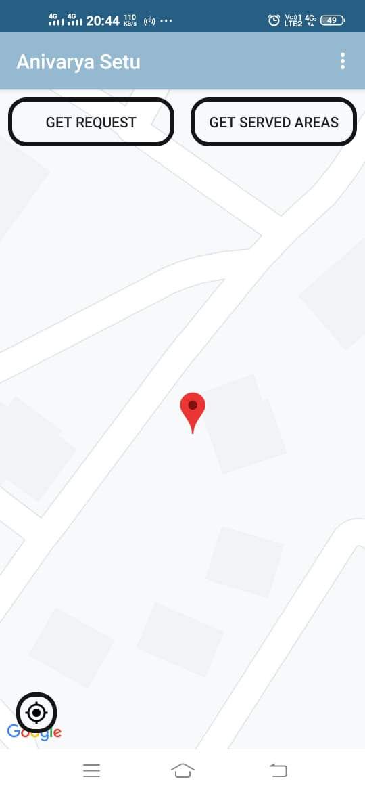</td>
    <td>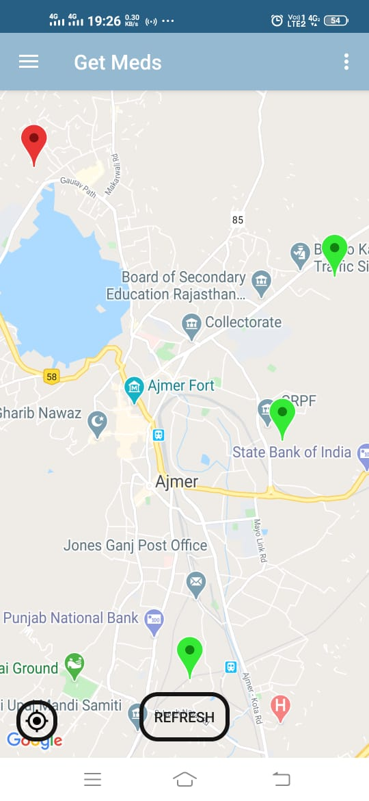</td>
    <td>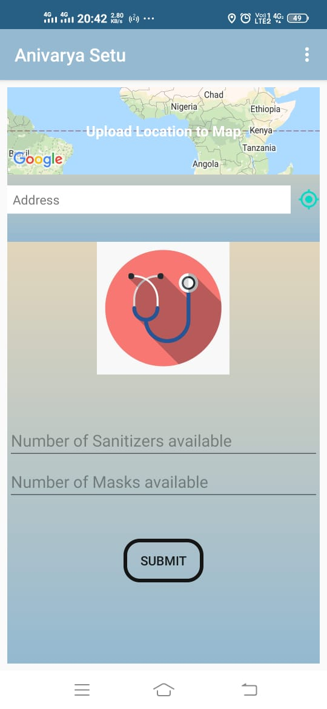</td>
  </tr>
  <tr>
    <td>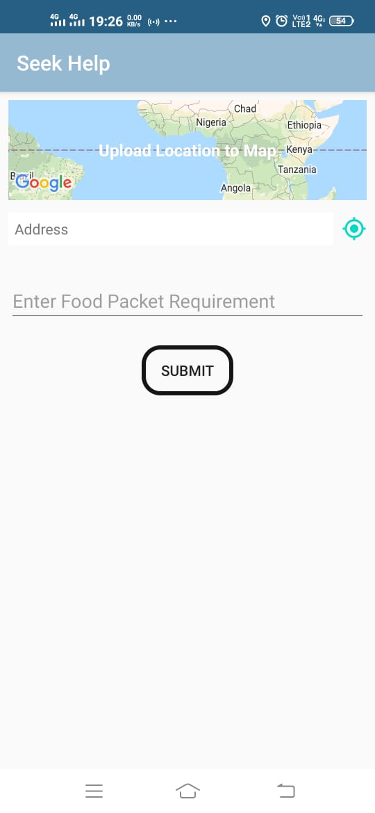</td>
    <td>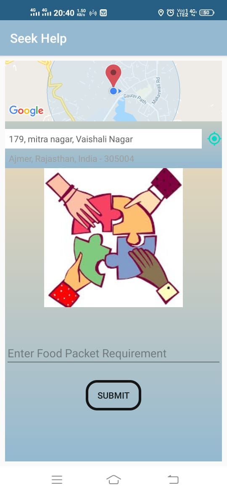</td>
  </tr>
</table>

## Web App:

#### Web app of this project can be found at: [covid-hack](https://github.com/pawangeek/CovidHack)
#### Built During : [Hackathon](https://www.hackerearth.com/challenges/hackathon/code19-india/)
